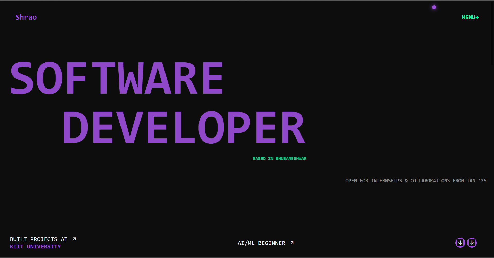

# 🌐 Shrao's Portfolio Website

A personal developer portfolio built using **HTML**, **CSS**, and **JavaScript**, showcasing projects, skills, and a short about-me section. Smooth animations are powered by **GSAP** and **Locomotive Scroll** for an interactive and modern feel.

---

## 🚀 Live Demo

🔗 [View Live Site](https://your-vercel-url.vercel.app)  
*(Replace this link with your actual Vercel deployment URL)*

---

## 🛠️ Tech Stack

- **HTML5**
- **CSS3**
- **JavaScript (Vanilla)**
- **GSAP** – Animation library
- **Locomotive Scroll** – Smooth scroll effects
- **RemixIcon** – Icon set

---

## 📂 Folder Structure

portfolio-site/
├── index.html # Main HTML entry point
├── proj1.css # Main stylesheet
├── loco.css # Locomotive Scroll styles
├── proj1.js # JavaScript interactions and animations
├── ai.png.webp # Project image
├── atten.png
├── notes.jpg
├── portfolio.png
├── shr_ghibli.jpg # Profile picture
└── .gitignore


---

## 💡 Features

- Custom animated cursor that follows the mouse
- Text reveal animations using GSAP
- Smooth scrolling with Locomotive Scroll
- Interactive image previews on hover
- Responsive layout for desktop and mobile
- Clean and minimal design

---

## 📸 Preview



---

## 📬 About Me

I'm a 2nd-year Computer Science student passionate about full-stack development and solving real-world problems through code. Currently exploring Java, DSA, and web technologies like HTML, CSS, and JavaScript. I enjoy learning by building and love figuring out how things work under the hood.

---

## 🚀 How to Deploy

1. Clone the repository:
   ```bash
   git clone https://github.com/yourusername/portfolio-site.git
   cd portfolio-site
2.(Optional) Customize content in index.html and assets

3.Push to GitHub:

bash
Copy
Edit
git add .
git commit -m "Initial commit"
git push -u origin main
Deploy to Vercel – it will auto-detect the static project

📄 License

This project is open source and available under the MIT License.